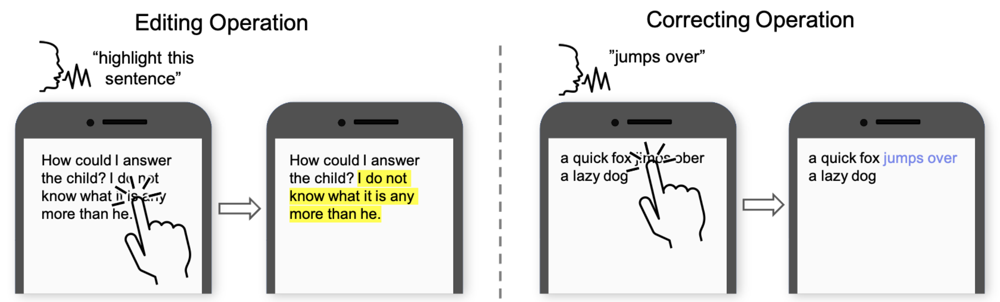

# Voice and Touch Based Error-tolerant Multimodal Text Editing and Correction for Smartphones

## Video Preview (30 seconds)
<p align="center"> 
 <iframe width="560" height="315" src="//player.bilibili.com/player.html?aid=210774558&bvid=BV1ma411275k&cid=489130990&page=1" scrolling="no" border="0" title="VT Preview" frameborder="no" framespacing="0" allowfullscreen="true"> </iframe>
</p>

## Abstract
Editing operations such as cut, copy, paste, and correcting errors in typed text is often tedious and challenging to perform on smartphones. In this paper, we present VT, a voice and touch-based multi-modal text editing and correction method for smartphones. To edit text with VT, the user glides over a text fragment with a finger and dictates a command, such as "bold" to change the format of the fragment, or the user can tap inside a text area and speak a command such as "highlight this paragraph" to edit the text. For text correcting, the user taps approximately at the area of erroneous text fragment and dictates the new content for substitution or insertion. VT combines touch and voice inputs with language context such as language model and phrase similarity to infer a user's editing intention, which can handle ambiguities and noisy input signals. It is a great advantage over the existing error correction methods (e.g., iOS’s Voice Control) which require precise cursor control or text selection. Our evaluation shows that VT significantly improves the efficiency of text editing and text correcting on smartphones over the touch-only method and the iOS’s Voice Control method. Our user studies showed that VT reduced the text editing time by 30.80%, and text correcting time by 29.97% over the touch-only method., and reduced the text editing time by 30.81%, and text correcting time by 47.96% over the iOS’s Voice Control method.

**Watch the nine-minute presentation video to learn more:**
<p align="center"> 
<iframe width="560" height="315" src="//player.bilibili.com/player.html?aid=338270684&bvid=BV11R4y1M7yk&cid=489128655&page=1" scrolling="no" border="0" title="VT presentation" frameborder="no" framespacing="0" allowfullscreen="true"> </iframe>
</p>
## Publication


Maozheng Zhao, Wenzhe Cui, I.V. Ramakrishnan, Shumin Zhai, and Xiaojun Bi. 2021. [Voice and Touch Based Error-tolerant Multimodal Text Editing and Correction for Smartphones.](https://dl.acm.org/doi/pdf/10.1145/3472749.3474742) In The 34th Annual ACM Symposium on User Interface Software and Technology (UIST ’21), October 10–14, 2021, Virtual Event, USA. ACM, New York, NY, USA, 17 pages. https://doi.org/10.1145/3472749.3474742

You can use the [editor on GitHub](https://github.com/Maozheng6/VT/edit/gh-pages/index.md) to maintain and preview the content for your website in Markdown files.

Whenever you commit to this repository, GitHub Pages will run [Jekyll](https://jekyllrb.com/) to rebuild the pages in your site, from the content in your Markdown files.

### Markdown

Markdown is a lightweight and easy-to-use syntax for styling your writing. It includes conventions for

```markdown
Syntax highlighted code block

# Header 1
## Header 2
### Header 3

- Bulleted
- List

1. Numbered
2. List

**Bold** and _Italic_ and `Code` text

[Link](url) and 
```

For more details see [Basic writing and formatting syntax](https://docs.github.com/en/github/writing-on-github/getting-started-with-writing-and-formatting-on-github/basic-writing-and-formatting-syntax).

### Jekyll Themes

Your Pages site will use the layout and styles from the Jekyll theme you have selected in your [repository settings](https://github.com/Maozheng6/VT/settings/pages). The name of this theme is saved in the Jekyll `_config.yml` configuration file.

### Support or Contact

Having trouble with Pages? Check out our [documentation](https://docs.github.com/categories/github-pages-basics/) or [contact support](https://support.github.com/contact) and we’ll help you sort it out.
